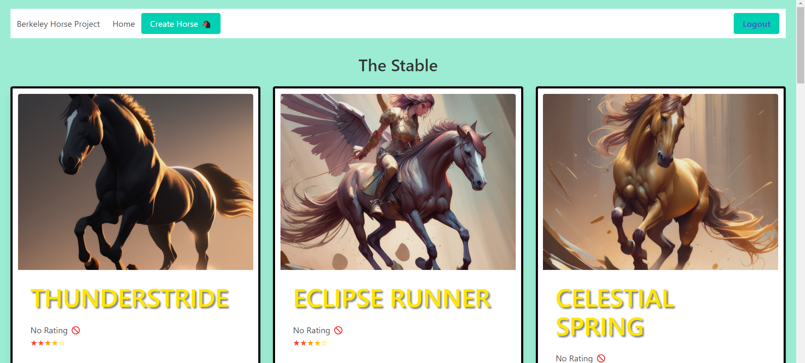
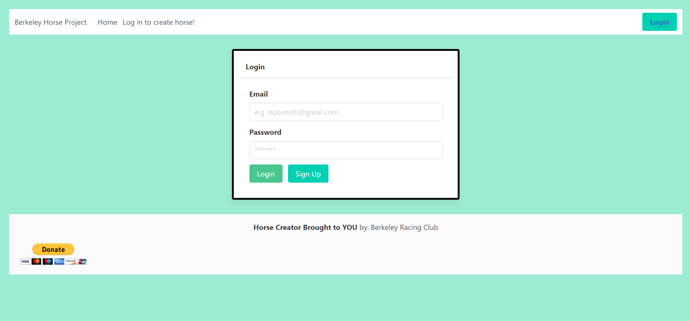
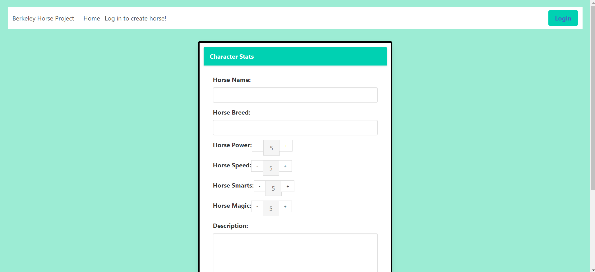

# Horse_creator# Horse_creator


## Description

  This collaborative group project is a full stack website for making D&D style horses. It uses the following packages: node.js, express, express-sessions, express handlebars, MySQL, Sequelize, React, bcrypt and dotenv.

## Table of Contents
  
* [Installation](#installation)
* [Usage](#usage)
* [License](#license)
* [Credits](#credits)
* [Tests](#tests)

## [Installation](#table-of-contents)

  No installing is needed if running the app from the site. If instead you intend to play around with it on a locale machine, you will need to clone the repo and run ```npm install``` to get the needed dependencies. Afterwords, you will have to source the schema with your own MySQL credentials and run the seed data.

## [Usage](#table-of-contents)
  
  Opening the website will show you the current stable of horses. You can click on each one to see the full stats and description of them.
  

  To use this app, you will need to sign up with an email in order to create a horse. After signing up and signing in, you will be redirected to the homepage and the Create Horse button will be made available. 
  

  You are able to give the horse a name, a breed and write a description of your horse. It's stats are assigned via a counter that ranges from 1-10. 
  

## [License](#table-of-contents)
  
  The application is covered under the following license:
  
  [ISC](https://opensource.org/licenses/ISC)  

## [Credits](#table-of-contents)
  
  This project was created by: Jean-Luc Votichenko, Jared Buttrey, Zach Antunes, Tanner Rhines, Andres Asencios and Jazz Dominguez. 

  https://github.com/Veladare/Horse_creator - link to main repo for this project.

  https://horse-creator-app-9839a5a7a948.herokuapp.com/ - link to the deployed site hosted via Heroku.

## [Tests](#table-of-contents)
  
  No testing suite was used on this project.